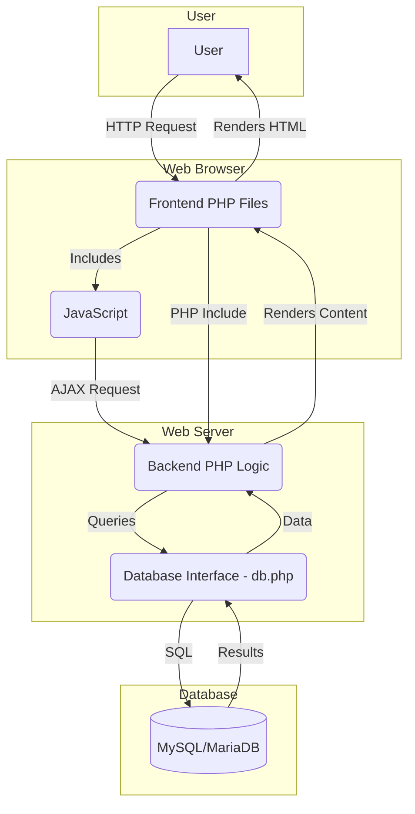

```mermaid
graph TD
    subgraph User
        A[User]
    end

    subgraph "Web Browser"
        B(Frontend PHP Files)
        C(JavaScript)
    end

    subgraph "Web Server"
        D(Backend PHP Logic)
        E(Database Interface - db.php)
    end

    subgraph "Database"
        F[(MySQL/MariaDB)]
    end

    A -- HTTP Request --> B
    B -- Renders HTML --> A
    B -- Includes --> C
    C -- AJAX Request --> D
    B -- PHP Include --> D
    D -- Queries --> E
    E -- SQL --> F
    F -- Results --> E
    E -- Data --> D
    D -- Renders Content --> B
```
