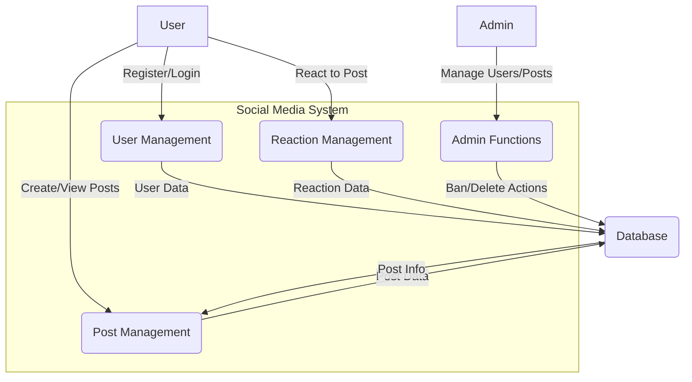

```mermaid
graph TD
    subgraph Social Media System
        P1(User Management)
        P2(Post Management)
        P3(Reaction Management)
        P4(Admin Functions)
    end

    A[User] -->|Register/Login| P1
    P1 -->|User Data| DB(Database)

    A -->|Create/View Posts| P2
    P2 -->|Post Data| DB
    DB -->|Post Info| P2

    A -->|React to Post| P3
    P3 -->|Reaction Data| DB

    C[Admin] -->|Manage Users/Posts| P4
    P4 -->|Ban/Delete Actions| DB
```
