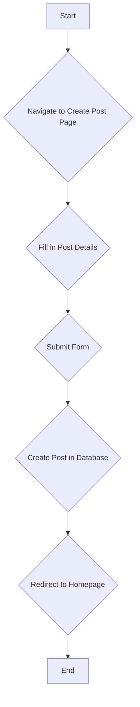

```mermaid
flowchart TD
    A[Start] --> B{Navigate to Create Post Page};
    B --> C{Fill in Post Details};
    C --> D{Submit Form};
    D --> E{Create Post in Database};
    E --> F{Redirect to Homepage};
    F --> G[End];
```