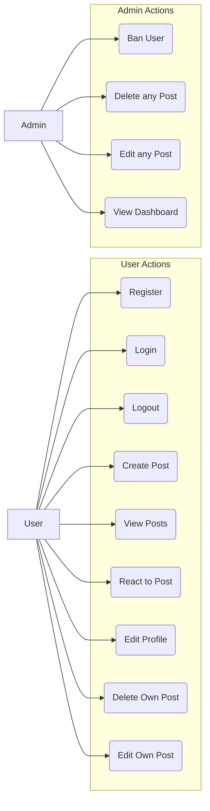

```mermaid
flowchart LR
    subgraph User Actions
        U1(Register)
        U2(Login)
        U3(Logout)
        U4(Create Post)
        U5(View Posts)
        U6(React to Post)
        U7(Edit Profile)
        U8(Delete Own Post)
        U9(Edit Own Post)
    end

    subgraph Admin Actions
        A1(Ban User)
        A2(Delete any Post)
        A3(Edit any Post)
        A4(View Dashboard)
    end

    User --> U1
    User --> U2
    User --> U3
    User --> U4
    User --> U5
    User --> U6
    User --> U7
    User --> U8
    User --> U9

    Admin --> A1
    Admin --> A2
    Admin --> A3
    Admin --> A4
```