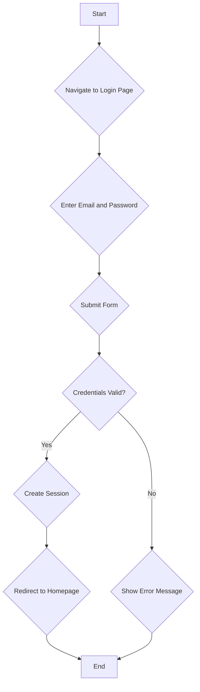

```mermaid
flowchart TD
    A[Start] --> B{Navigate to Login Page};
    B --> C{Enter Email and Password};
    C --> D{Submit Form};
    D --> E{Credentials Valid?};
    E -- Yes --> F{Create Session};
    F --> G{Redirect to Homepage};
    G --> H[End];
    E -- No --> I{Show Error Message};
    I --> H;
```