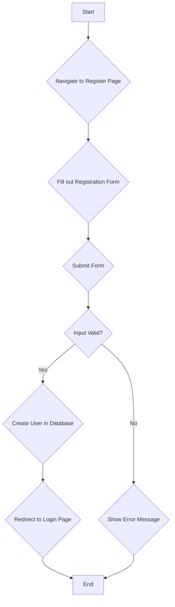

```mermaid
flowchart TD
    A[Start] --> B{Navigate to Register Page};
    B --> C{Fill out Registration Form};
    C --> D{Submit Form};
    D --> E{Input Valid?};
    E -- Yes --> F{Create User in Database};
    F --> G{Redirect to Login Page};
    G --> H[End];
    E -- No --> I{Show Error Message};
    I --> H;
```